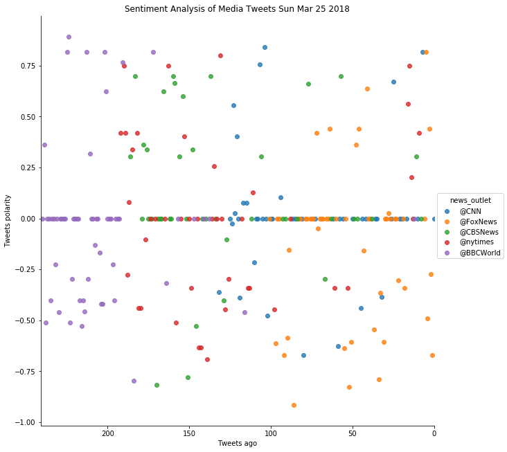
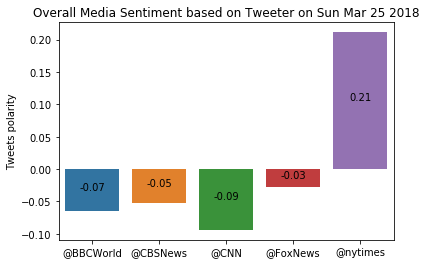

# News Mood
This Python script performs a sentiment analysis using Vader of the Twitter activity of selected news oulets: *BBC*, *CBS*, *CNN*, *Fox*, and *New York times*.
- The script collects a sample of tweets, and the sentiment scores will vary depending on the time of day, or the day the script runs. 
- On the sample collected, the overall trend for most news outlet tweets are messages of average sentiments score with more negative weight.


```python
# Dependencies
import tweepy
import numpy as np
import config
import pandas as pd
import matplotlib.pyplot as plt
import seaborn as sns
from datetime import datetime


# Setup Tweepy API Authentication
auth = tweepy.OAuthHandler(config.consumer_key, config.consumer_secret)
auth.set_access_token(config.access_token, config.access_token_secret)
api = tweepy.API(auth, parser=tweepy.parsers.JSONParser())

# Setup Vader Sentiment Analyzer
from vaderSentiment.vaderSentiment import SentimentIntensityAnalyzer
analyzer = SentimentIntensityAnalyzer()

today = datetime.now()
today
```


    datetime.datetime(2018, 3, 26, 12, 59, 51, 27954)


```python
# define function for date manupulation
def seconds_ago(stringdate):
    dtime = datetime.strptime(stringdate,"%a %b %d %H:%M:%S %z %Y")
    dtime = dtime.replace(tzinfo=None)
    dtime = today - dtime    
    return dtime.seconds

#define function for filtering tweets
def human_tweet(tweet):
    # "Real Person" Filters
    min_tweets = 5
    max_tweets = 10000
    max_followers = 2500
    max_following = 2500
    lang = "en"

    if (tweet["followers_count"] < max_followers and
        tweet["statuses_count"] > min_tweets and
        tweet["statuses_count"] < max_tweets and
        tweet["friends_count"] < max_following and
        tweet["lang"] == lang):
        return True
    else:
        return False

# define function for collecting tweets
def collect_tweets(target_news,outcsv):
    sentiments =[]
    for search_term in target_news:
        oldest_tweet = ""
        print(f"Collecting tweets for {search_term}...")                   
        for x in range(5): 
            public_tweets = api.search(
                            search_term,
                            count=20,
                            result_type="recent",
                            max_id=oldest_tweet)
            for tweet in public_tweets["statuses"]:
                if human_tweet(tweet['user']):
                    target_string = tweet['text']
                    vader_scores = analyzer.polarity_scores(target_string)
                    tweet_analysis = {'news_outlet':search_term,
                                       'date':tweet['created_at'],
                                       'compound':vader_scores["compound"],
                                       'positive':vader_scores["pos"],
                                       'negative':vader_scores["neg"],
                                       'neutral':vader_scores["neu"],
                                       'tweet':target_string}
                    sentiments.append(tweet_analysis)
                oldest_tweet = tweet['id']
    # Aggregate into a dataframe the data collected
    sentiment_df = pd.DataFrame(sentiments) 

    # Update date and sort
    sentiment_df['seconds ago'] = sentiment_df['date'].map(seconds_ago)
    sentiment_df = sentiment_df.sort_values("seconds ago")
    sentiment_df.to_csv(outcsv+".csv",index=False)
    print(f"... collected {len(sentiment_df)} total tweets")
    display(sentiment_df.head())
    
#define function for plotting     
def create_plots(filename):
    with open(filename+".csv") as sentimentfile:
        sentiment_df = pd.read_csv(sentimentfile, delimiter=',')        
        psd = sentiment_df.reset_index()
        sns.lmplot(x="index", y="compound", hue="news_outlet",data=psd, size=9, fit_reg=False)        
        title = "Sentiment Analysis of Media Tweets " + today.strftime("%a %b %d %Y")
        plt.title(title)
        plt.ylabel("Tweets polarity")
        plt.xlabel("Tweets ago")
        plt.xlim(len(psd),0) # inverse the x- axis to show decrease over time

        # Save the figure1
        plt.savefig(filename+"_sentiment.png")
        plt.show()

        averages = sentiment_df.groupby("news_outlet")["compound"].mean()
        x_values = np.arange(len(averages))
        sns.barplot(x_values, averages)
        plt.xticks(x_values, target_news)
        title = "Overall Media Sentiment based on Tweeter on " + today.strftime("%a %b %d %Y")
        plt.title(title)
        plt.ylabel("Tweets polarity")
        for a in x_values:
            plt.annotate(
                        '{:,.2f}'.format(averages[a]),  # Use values formated as label
                        (a, averages[a]/2),              # Place label at center of the bar
                        ha='center')                     # align to center

        # Save the figure2
        plt.savefig(filename+"_overall.png")
        plt.legend(loc='best')
        plt.show()    

```


```python
target_news = ('@BBCWorld','@CBSNews', '@CNN', '@FoxNews', '@nytimes')
tweet_data_file = "output/tweet_data_media"
```


```python
collect_tweets(target_news,tweet_data_file)
```

    Collecting tweets for @BBCWorld...
    Collecting tweets for @CBSNews...
    Collecting tweets for @CNN...
    Collecting tweets for @FoxNews...
    Collecting tweets for @nytimes...
    ... collected 212 total tweets


<div>
<style>
    .dataframe thead tr:only-child th {
        text-align: right;
    }

    .dataframe thead th {
        text-align: left;
    }

    .dataframe tbody tr th {
        vertical-align: top;
    }
</style>
<table border="1" class="dataframe">
  <thead>
    <tr style="text-align: right;">
      <th></th>
      <th>compound</th>
      <th>date</th>
      <th>negative</th>
      <th>neutral</th>
      <th>news_outlet</th>
      <th>positive</th>
      <th>tweet</th>
      <th>seconds ago</th>
    </tr>
  </thead>
  <tbody>
    <tr>
      <th>126</th>
      <td>0.4585</td>
      <td>Mon Mar 26 19:59:38 +0000 2018</td>
      <td>0.000</td>
      <td>0.850</td>
      <td>@FoxNews</td>
      <td>0.150</td>
      <td>RT @ainsleyearhardt: .@dbongino: "Trying to di...</td>
      <td>61213</td>
    </tr>
    <tr>
      <th>178</th>
      <td>0.0000</td>
      <td>Mon Mar 26 19:59:38 +0000 2018</td>
      <td>0.000</td>
      <td>1.000</td>
      <td>@nytimes</td>
      <td>0.000</td>
      <td>RT @nytimes: Louis Vuitton Names Virgil Abloh ...</td>
      <td>61213</td>
    </tr>
    <tr>
      <th>127</th>
      <td>0.4215</td>
      <td>Mon Mar 26 19:59:37 +0000 2018</td>
      <td>0.090</td>
      <td>0.752</td>
      <td>@FoxNews</td>
      <td>0.158</td>
      <td>RT @FoxNews: .@charliekirk11: "They're using a...</td>
      <td>61214</td>
    </tr>
    <tr>
      <th>128</th>
      <td>-0.4003</td>
      <td>Mon Mar 26 19:59:37 +0000 2018</td>
      <td>0.155</td>
      <td>0.757</td>
      <td>@FoxNews</td>
      <td>0.088</td>
      <td>@MissTygrr @FoxNews Yeah old bag. Look at your...</td>
      <td>61214</td>
    </tr>
    <tr>
      <th>129</th>
      <td>-0.6908</td>
      <td>Mon Mar 26 19:59:37 +0000 2018</td>
      <td>0.825</td>
      <td>0.175</td>
      <td>@FoxNews</td>
      <td>0.000</td>
      <td>@FoxNews terrorist</td>
      <td>61214</td>
    </tr>
  </tbody>
</table>
</div>


```python
create_plots(tweet_data_file)
```







