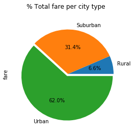
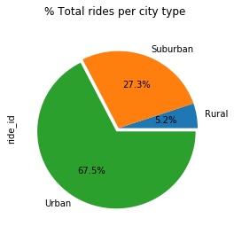
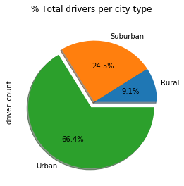

# Pyber

#### Trend analysis
Given fake data on share rides over 3 types of cities (Urban, Suburban, and Rural), analyze the data to detect any patterns or trends. Observations include:
- Overall the urban cities overall have higher number of rides than suburban and rural.
- Urban cities count with more drivers overall.
- Rural cities score higher fares on average.
- Suburban cities average the same as urban cities but with fewer rides.


```python
# Imports
import pandas as pd
import numpy as np
import matplotlib.pyplot as plt
import scipy.stats as stats
import random
import os
```


```python
# Import our data into pandas from CSV
csvcity = os.path.join('raw_data', 'city_data.csv')
csvride = os.path.join('raw_data', 'ride_data.csv')
city_df = pd.read_csv(csvcity)
ride_df = pd.read_csv(csvride)
```


```python
combined_df = pd.merge(city_df, ride_df,how='outer',on='city')
```

#### Key Variables


```python
byCity = combined_df.groupby('city')
percityavg = byCity['fare'].mean()
perridetotal = byCity['ride_id'].count()
percitydrivers = byCity['driver_count'].unique()
percitydrivers = [x[0] for x in percitydrivers]
percitytype = byCity['type'].unique().map("%s".join)
```


```python
city_stats = {'Avg Fare':percityavg,
              'Total Rides':perridetotal,
              'Drivers Total':percitydrivers,
             'Type':percitytype}
city_stats_df = pd.DataFrame(city_stats)
```


```python
urban = city_stats_df.loc[city_stats_df['Type']=='Urban',:]
suburban = city_stats_df.loc[city_stats_df['Type']=='Suburban',:]
rural = city_stats_df.loc[city_stats_df['Type']=='Rural',:]

fig = plt.figure(figsize=(10, 10))
ax=fig.add_subplot(111)

size_u = [x*10 for x in urban['Drivers Total']]
size_s = [x*10 for x in suburban['Drivers Total']]
size_r = [x*10 for x in rural['Drivers Total']]

#create scatter plots from the dataframes
ax.scatter(urban['Total Rides'],urban['Avg Fare'], 
            edgecolor='black',alpha=0.25, s=size_u, 
            c='r', label='Urban')
ax.scatter(suburban['Total Rides'],suburban['Avg Fare'], 
            edgecolor='black',alpha=0.25,
            c='b', s=size_s,label='Suburban')
ax.scatter(rural['Total Rides'],rural['Avg Fare'], s=size_r, 
            edgecolor='black',alpha=0.25,
            c='g', label='Rural')

plt.title('Pyber Ride sharing data')
plt.xlabel('Total Number of Rides')
plt.ylabel('Average Fare per city')
plt.legend(loc='best')

```


    <matplotlib.legend.Legend at 0x1a1a045198>


```python
plt.show()
```


### Total Fare by city type


```python
fares_df = pd.DataFrame(combined_df.groupby('type')['fare'].sum())
print(fares_df)
explode = (0,0,0.05)
fares_df.plot(kind='pie',autopct="%1.1f%%",explode=explode,subplots=True,figsize=(4,4),legend=False,title="% Total fare per city type")
plt.show()
```

                  fare
    type              
    Rural      4255.09
    Suburban  20335.69
    Urban     40078.34





### Total Rides by City


```python
rides_df = pd.DataFrame(combined_df.groupby('type')['ride_id'].count())
print(rides_df.head())
explode = (0,0,0.05)
rides_df.plot(kind='pie',explode=explode,autopct="%1.1f%%",subplots=True,figsize=(4,4),legend=False,title='% Total rides per city type')
plt.show()
```

              ride_id
    type             
    Rural         125
    Suburban      657
    Urban        1625





### Total drivers per city type


```python
drivers_df = pd.DataFrame(combined_df.groupby('type')['driver_count'].max())
print(drivers_df.head())
explode=(0,0,0.1)
drivers_df.plot(kind='pie',explode=explode,shadow=True,autopct="%1.1f%%",subplots=True,figsize=(4,4),legend=False,title='% Total drivers per city type')
plt.show()
```

              driver_count
    type                  
    Rural               10
    Suburban            27
    Urban               73




